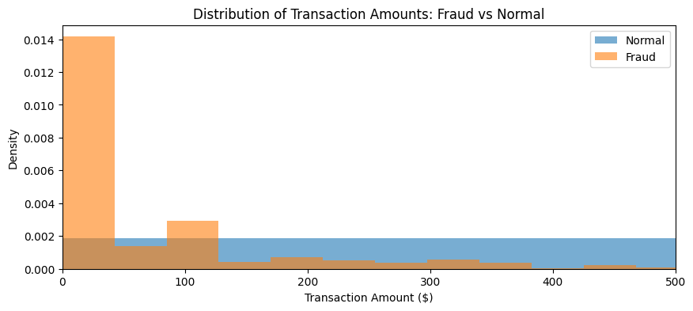
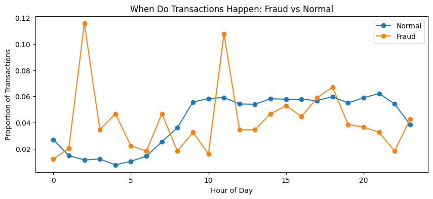
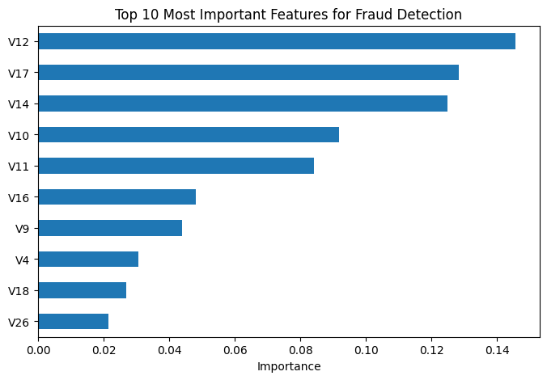

# Credit Card Fraud Detection

Exploratory data analysis and machine learning models to detect fraudulent credit card transactions, using a real-world anonymized dataset of 284,807 transactions.

## Overview

This project analyzes patterns in credit card fraud and builds a classification model to automatically flag suspicious transactions. Fraud makes up just 0.17% of all transactions in this dataset, making it a genuinely hard, real-world imbalanced classification problem — the kind faced by banks and payment processors every day.

## Dataset

- **Source:** [Credit Card Fraud Detection dataset](https://www.kaggle.com/mlg-ulb/creditcardfraud), Kaggle (ULB Machine Learning Group)
- 284,807 transactions from European cardholders, September 2013
- 492 confirmed fraud cases (0.173%)
- Features V1–V28 are PCA-anonymized for privacy; `Time` and `Amount` are the only two original, human-readable columns

## Key Findings

**1. Fraud transactions skew toward smaller amounts**

Fraudulent transactions cluster heavily at low dollar values, consistent with "card-testing" behavior — fraudsters often make small transactions to verify a stolen card works before attempting larger charges.

**2. Fraud is disproportionately more common during low-monitoring hours**

Fraud spikes noticeably during early morning hours, while legitimate spending stays low and steady overnight, then rises through the day — suggesting fraud is more likely to occur when cardholders are less likely to notice suspicious activity in real time.

**3. A handful of anonymized features drive most predictions**

The model relies most heavily on features V12, V17, V14, V10, and V11 — notably, `Amount` and `Time` were not among the top predictors, despite showing visible patterns on their own.

## Modeling Approach

Three models were trained and compared:

| Model | Precision | Recall | F1-Score | Fraud Caught | False Alarms |
|---|---|---|---|---|---|
| Logistic Regression | 0.83 | 0.64 | 0.72 | 63/98 | 13 |
| Random Forest (default threshold) | 0.96 | 0.81 | 0.88 | 79/98 | 3 |
| **Random Forest (tuned threshold = 0.4)** | **0.92** | **0.86** | **0.89** | **84/98** | 7 |
| XGBoost (default threshold) | 0.86 | 0.80 | 0.83 | 78/98 | 20 |

**Selected model: Random Forest with a tuned decision threshold of 0.4.**

Notably, tuning the classification threshold on Random Forest outperformed switching to a more complex algorithm (XGBoost) entirely — a reminder that careful tuning of a solid model can beat blindly reaching for a fancier one.

## Limitations

- Features V1–V28 are anonymized via PCA, so while we can identify *which* features matter most, we cannot interpret *what real-world transaction attributes* they represent.
- This dataset covers a two-day period from a single (anonymized) source, so patterns may not generalize to other time periods, regions, or card networks.

## Tools Used

Python, pandas, scikit-learn, XGBoost, matplotlib, Google Colab

## Files

- `fraud_detection_analysis.ipynb` — full analysis notebook (EDA, modeling, evaluation)
